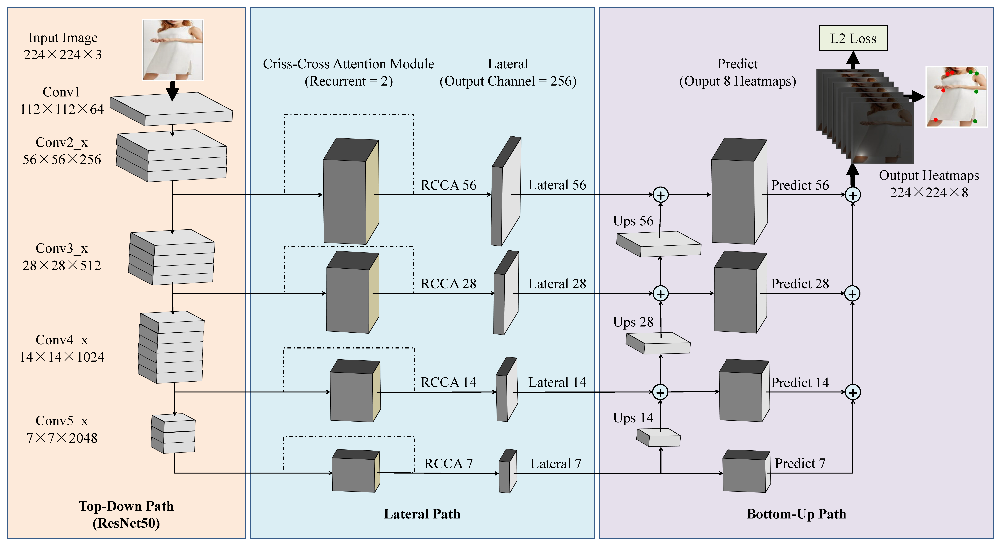

## Deep Criss-Cross Attention Module for Fashion Landmark Detection




### Requirements
- Python 3.6
- gcc 4.8.5
- CUDA 9.0
- Pytorch >= 1.0.1
- torchvision

### Quick Start
* We referred the code in [[site](https://github.com/suminlee94/GLE_FLD)], [[site](https://github.com/GengDavid/pytorch-cpn)], and [[site](https://github.com/speedinghzl/CCNet)].

#### 1. Download the datasets
* Deepfashion [[download](http://mmlab.ie.cuhk.edu.hk/projects/DeepFashion/AttributePrediction.html)]
* FLD [[download](http://mmlab.ie.cuhk.edu.hk/projects/DeepFashion/LandmarkDetection.html)]
 
#### 2. Unzip './Anno/info.zip' file.

#### 3. Train
```
# 'root' and 'dataset' options are necessary.
usage: train.py [-h] --root ROOT -d DATASET [DATASET ...]
                [--base_epoch BASE_EPOCH] [-b BATCHSIZE] [--epoch EPOCH]
                [--decay-epoch DECAY_EPOCH] [-g GAMMA] [-lr LEARNING_RATE]
                [--evaluate EVALUATE] [-w WEIGHT_FILE] [--loss-type LOSS_TYPE]
                [--cca CCA] [--update-weight UPDATE_WEIGHT]

optional arguments:
  -h, --help            show this help message and exit
  --root ROOT           root path to data directory (default: None)
  -d DATASET [DATASET ...], --dataset DATASET [DATASET ...]
                        deepfashion or fld (default: None)
  --base_epoch BASE_EPOCH
                        base epoch of models to save (default: 0)
  -b BATCHSIZE, --batchsize BATCHSIZE
                        batchsize (default: 50)
  --epoch EPOCH         the number of epoch (default: 30)
  --decay-epoch DECAY_EPOCH
                        decay epoch (default: 5)
  -g GAMMA, --gamma GAMMA
                        decay gamma (default: 0.1)
  -lr LEARNING_RATE, --learning-rate LEARNING_RATE
                        initial learning rate (default: 0.0001)
  --evaluate EVALUATE   evaluation only (default: 0)
  -w WEIGHT_FILE, --weight-file WEIGHT_FILE
                        weight file (default: None)
  --loss-type LOSS_TYPE
                        loss function type (mse or cross_entropy) (default:
                        mse)
  --cca CCA             criss-cross attention module (default: 1)
  --update-weight UPDATE_WEIGHT
  
example: 
python train.py --root ../FLD/ --dataset fld --base_epoch 0 --epoch 9 --learning-rate 1e-3 --decay-epoch 3 -g 0.4 --loss-type mse -b 32 --cca 0
python train.py --root ../FLD/ --dataset fld -w ./models/model_009.pkl --base_epoch 109 --epoch 9 --learning-rate 1e-4 --decay-epoch 3 -g 0.4 --loss-type mse -b 32 --cca 1 --update-weight 1
python train.py --root ../FLD/ --dataset fld -w ./models/model_009.pkl --base_epoch 109 --epoch 9 --learning-rate 1e-4 --decay-epoch 3 -g 0.4 --loss-type mse -b 24 --cca 1 --update-weight 1
```

start "Evaluate" test_sh.bat
python train.py --root ../FLD/ --dataset fld -w ./models_fld_avg/model_010.pkl --base_epoch 10 --epoch 1 --evaluate 1 --learning-rate 1e-4 --decay-epoch 3 -g 0.4 --loss-type mse -b 32 --cca 0 --update-weight 0

#### 4. Predict
```
# You can only change the weight files and target directory in python file currently.
# To ignore any of the weight files, just set the value to None. Target directory is required.
python predict_both.py --root ROOT -d DATASET --batchsize 1
```

